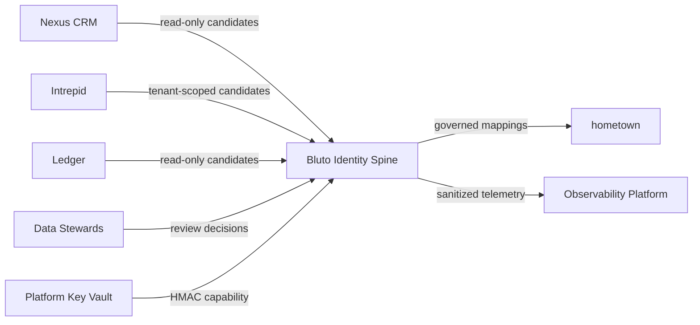
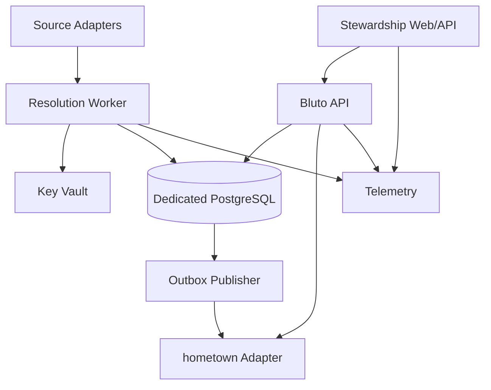
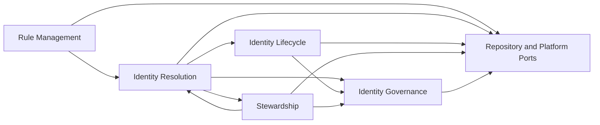
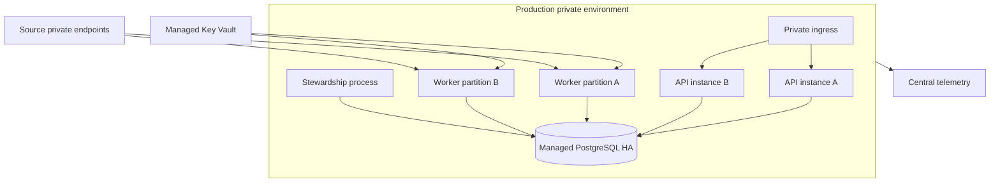
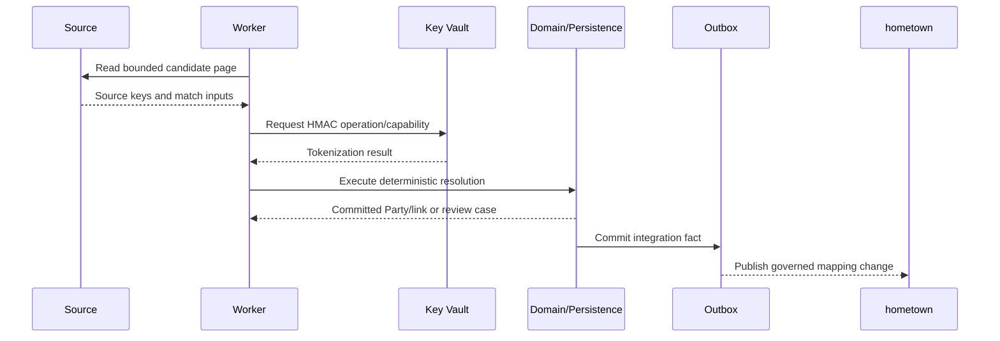

# Bluto Architecture Views

| Metadata | Value |
|---|---|
| Document ID | BLUTO-ARCH-VIEWS-001 |
| Artifact ID | ART-BLUTO-ARCH-VIEWS-001-v1.1.0 |
| Version | 1.1.0 |
| Status | Baselined |
| Owner | Enterprise Architecture |
| Baseline | Repository Baseline B |
| Stream | 3 — Architecture |
| Authority Level | RAH-4 |
| Depends On | BLUTO-BASE-GOV-001, BLUTO-BASE-GOV-002, BLUTO-BASE-GOV-004, BLUTO-BASE-STD-001, BLUTO-BASE-STD-002, BLUTO-BASE-STD-003, BLUTO-BASE-STD-004, BLUTO-ARCH-REF-001, BLUTO-ARCH-LOGICAL-001, BLUTO-ARCH-PHYSICAL-001, BLUTO-ARCH-DEPLOY-001, BLUTO-DOM-REVIEW-001 |
| Supersedes | None |
| Approval Date | 2026-07-30 |
| Effective Date | 2026-07-30 |
| Review Date | 2027-07-30 |
| Classification | Internal |

## Governing references

This document is subordinate to the authoritative Bluto Enterprise Identity Spine v0.1 and the immutable Stream 1 and Stream 2 baselines. It preserves the following upstream invariants:

- Bluto owns identity mapping, stable Party identifiers, link lineage, rules, confidence, review decisions, and merge/split history.
- Bluto does not own source-system business attributes and shall not become a golden-record or master-data store.
- v1 resolution is deterministic, incremental batch, and tenant-scoped by default.
- raw strong identifiers are never persisted in Bluto; matching uses HMAC-SHA-256 tokens created with a Tier-0 key held outside the database.
- Party identifiers are never reused, and historical resolution is effective-dated and reproducible.
- hometown consumes Bluto mappings read-only and never performs ad hoc identity matching.

## 1. Purpose

This document provides controlled viewpoints for stakeholders. The Repository Reference Architecture remains the canonical orientation view.

## 2. System context view

## 3. Container view

## 4. Component view

## 5. Deployment view

## 6. Information-flow view

## 7. View consistency rules

All diagrams are explanatory projections of the same architecture. A diagram may omit detail but may not change ownership, dependency direction, trust boundary, or v1 operating model.

## Document control

This controlled document is immutable in this release. Changes require the approved ADR and change-control process. Cross-references use Constitutional Document IDs; filenames are non-authoritative.
