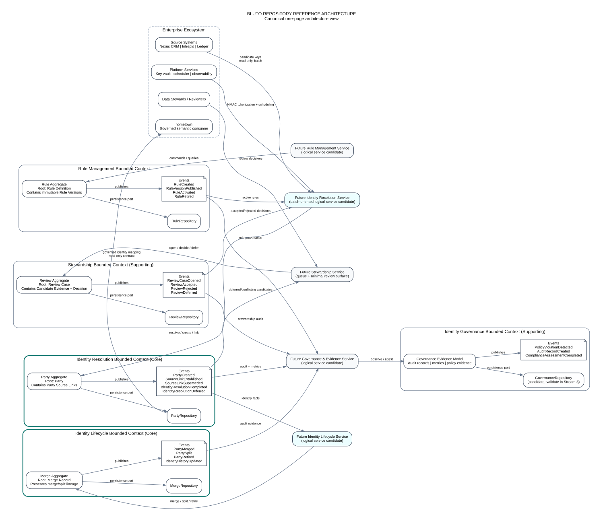

# Bluto Repository Reference Architecture

| Metadata | Value |
|---|---|
| Document ID | BLUTO-ARCH-REF-001 |
| Artifact ID | ART-BLUTO-ARCH-REF-001-v1.1.0 |
| Version | 1.1.0 |
| Status | Baselined |
| Owner | Enterprise Architecture |
| Baseline | Repository Baseline B |
| Stream | 3 — Architecture |
| Authority Level | RAH-4 |
| Depends On | BLUTO-BASE-GOV-001, BLUTO-BASE-GOV-002, BLUTO-BASE-GOV-004, BLUTO-BASE-STD-001, BLUTO-BASE-STD-002, BLUTO-BASE-STD-003, BLUTO-BASE-STD-004, BLUTO-DOM-OVERVIEW-001, BLUTO-DOM-CORE-001, BLUTO-DOM-BC-001, BLUTO-DOM-UL-001, BLUTO-DOM-ENTITY-001, BLUTO-DOM-VALUEOBJECT-001, BLUTO-DOM-AGGREGATE-001, BLUTO-DOM-EVENT-001, BLUTO-DOM-REPOSITORY-001, BLUTO-DOM-STATE-001, BLUTO-DOM-CANONICAL-001, BLUTO-DOM-TRACE-001, BLUTO-DOM-REVIEW-001 |
| Supersedes | None |
| Approval Date | 2026-07-30 |
| Effective Date | 2026-07-30 |
| Review Date | 2027-07-30 |
| Classification | Internal |

## 1. Purpose

This document establishes the canonical repository reference architecture for Bluto. It connects the approved Stream 2 domain model to the architecture work that begins in Stream 3 by showing, in one controlled view:

- bounded contexts;
- aggregate and consistency boundaries;
- repository ports;
- domain events; and
- candidate future application services.

The diagram is the standard orientation view for architecture reviews, contract design, security analysis, test planning, deployment design, AI-assisted implementation, and project planning. Downstream documents may create more detailed views, but they shall preserve the boundaries and directionality shown here unless an approved Architecture Decision Record changes them.

## 2. Authority and interpretation

The Bluto Enterprise Identity Spine v0.1 remains authoritative. This reference architecture does not change its data model, guardrails, delivery slices, or operating model.

The following interpretation rules are normative:

1. **Bounded contexts are semantic ownership boundaries.** They are not automatically services, repositories, processes, deployables, or teams.
2. **Aggregates are consistency boundaries.** They are not database tables and shall not be bypassed by application logic.
3. **Repositories are domain-facing persistence ports.** They do not prescribe SQL, an ORM, a database product, or a separate datastore.
4. **Events are immutable business facts.** They do not prescribe a broker, event bus, queue, or streaming platform.
5. **Future services are logical architecture candidates.** Their presence in the diagram does not authorize a microservice topology. Stream 3 must decide whether these responsibilities are implemented as modules, processes, jobs, services, or a combination.
6. **The v1 resolution path remains incremental batch with an on-demand trigger.** The diagram shall not be interpreted as authorizing query-time or streaming identity resolution.
7. **Identity is resolved ahead of consumption.** Hometown reads governed mappings; it does not write Bluto state and does not infer identity in semantic models.

## 3. Canonical one-page view



A PNG rendering is also retained for tools that do not render SVG: [`assets/REPOSITORY-REFERENCE-ARCHITECTURE.png`](assets/REPOSITORY-REFERENCE-ARCHITECTURE.png).

## 4. Architecture narrative

### 4.1 Enterprise inputs and consumers

Nexus CRM, Intrepid, and the ledger remain systems of record for business attributes. Bluto extracts candidate identity keys through read-only, batch-oriented integration. Normalization and HMAC tokenization occur before persistence; raw strong identifiers do not enter the Bluto store.

Hometown is the governed downstream consumer of Bluto identity mappings. Its relationship is read-only and contract validated. Cross-domain joins resolve through `party_id`; ad hoc key matching remains prohibited.

Data stewards interact only with the Stewardship context. Platform services supply scheduling, secrets, key-vault operations, and observability without taking ownership of identity semantics.

### 4.2 Rule Management bounded context

**Purpose:** Define, version, validate, publish, activate, and retire match rules while preserving historical reproducibility.

**Aggregate:** Rule Aggregate, rooted at Rule Definition and containing immutable Rule Versions.

**Repository:** `RuleRepository`.

**Events:** `RuleCreated`, `RuleVersionPublished`, `RuleActivated`, and `RuleRetired`.

**Future service candidate:** Rule Management Service. This may be implemented as an internal module or administration surface rather than a separately deployable service.

The Identity Resolution context consumes only approved, active rule versions. Rules are source-controlled artifacts; the active ruleset version must remain traceable to every resulting link.

### 4.3 Identity Resolution bounded context

**Purpose:** Execute deterministic rules, create stable Party identities, establish or supersede Party Source Links, and defer ambiguous outcomes for stewardship.

**Aggregate:** Party Aggregate, rooted at Party and containing Party Source Links as governed members of the consistency boundary.

**Repository:** `PartyRepository`.

**Events:** `PartyCreated`, `SourceLinkEstablished`, `SourceLinkSuperseded`, `IdentityResolutionCompleted`, and `IdentityResolutionDeferred`.

**Future service candidate:** Identity Resolution Service. For v1, this is a batch-oriented logical application service with a scheduled cadence and an on-demand trigger.

This context enforces the core invariants:

- `party_id` is stable and never reused;
- a source record has at most one active Party Source Link at an instant;
- resolution is tenant-scoped by default;
- deterministic matching precedes stewardship;
- sub-threshold candidates never auto-link; and
- no business attributes are persisted as Party state.

### 4.4 Identity Lifecycle bounded context

**Purpose:** Govern merge, split, retirement, effective dating, lineage, and point-in-time identity reconstruction.

**Aggregate:** Merge Aggregate, rooted at Merge Record and holding the references and evidence required to preserve merge and split lineage.

**Repository:** `MergeRepository`.

**Events:** `PartyMerged`, `PartySplit`, `PartyRetired`, and `IdentityHistoryUpdated`.

**Future service candidate:** Identity Lifecycle Service.

The Lifecycle context coordinates changes to Party identity through published contracts and events. It never deletes or reuses identifiers. A split creates new Party identifiers; a merge retains the absorbed identifier and its lineage. Effective dating must support historical resolution without reinterpreting prior answers.

### 4.5 Stewardship bounded context

**Purpose:** Manage unresolved and conflicting candidates, collect evidence, and record accept, reject, or defer decisions with reviewer identity and audit history.

**Aggregate:** Review Aggregate, rooted at Review Case and containing candidate evidence and the final Review Decision.

**Repository:** `ReviewRepository`.

**Events:** `ReviewCaseOpened`, `ReviewAccepted`, `ReviewRejected`, and `ReviewDeferred`.

**Future service candidate:** Stewardship Service, including the review queue and a deliberately minimal review surface.

A review decision is a governed assertion, not an informal override. Accepted and rejected decisions are immutable audit facts. The review surface may remain operationally simple, but the evidence and decision record may not be simplified away.

### 4.6 Identity Governance bounded context

**Purpose:** Produce governance evidence, audit records, compliance evidence, operational identity metrics, and policy-violation signals across the identity lifecycle.

**Model:** Governance Evidence Model containing audit records, policy evidence, and metrics. Stream 2 did not establish a definitive aggregate root for all governance evidence; Stream 3 must validate whether one aggregate is appropriate or whether append-only projections are the better architecture.

**Repository candidate:** `GovernanceRepository`. This name is provisional and must be confirmed or replaced by a Stream 3 decision before it becomes a contract.

**Events:** `PolicyViolationDetected`, `AuditRecordCreated`, and `ComplianceAssessmentCompleted`.

**Future service candidate:** Governance and Evidence Service.

Governance observes and attests to domain activity. It does not take ownership of Party, Rule, Review, or Merge state and shall not become a second business-state store.

## 5. Interaction model

The primary dependency flow is:

```text
Approved Rule Versions
        │
        ▼
Identity Resolution ───── deferred/conflicting candidate ─────► Stewardship
        │                                                        │
        │ identity facts                                         │ reviewed decision
        ▼                                                        ▼
Identity Lifecycle ◄──────────────────────────────────── Identity Resolution
        │
        └────────────── domain facts and evidence ──────────────► Identity Governance
```

The interaction rules are:

- application services issue commands to aggregate roots and execute queries through explicit ports;
- repositories persist only their owning aggregate boundary;
- cross-context state is not modified through direct repository access;
- events communicate completed business facts and may drive downstream processing;
- consumers tolerate duplicate and delayed event delivery;
- ordering is relied upon only within an aggregate stream unless a later contract explicitly provides a stronger guarantee;
- correlation and causation identifiers preserve end-to-end lineage;
- external consumers receive published contracts, never internal aggregate representations.

## 6. Repository and ownership matrix

| Bounded context | Aggregate/model | Domain-facing repository | Representative events | Future logical service | Ownership rule |
|---|---|---|---|---|---|
| Rule Management | Rule Aggregate | `RuleRepository` | Rule created, published, activated, retired | Rule Management Service | Owns rule semantics and versions; does not resolve identity |
| Identity Resolution | Party Aggregate | `PartyRepository` | Party created; links established/superseded; resolution completed/deferred | Identity Resolution Service | Owns current Party and link consistency; does not own merge policy or review decisions |
| Identity Lifecycle | Merge Aggregate | `MergeRepository` | Party merged, split, retired; history updated | Identity Lifecycle Service | Owns merge/split lineage and historical reconstruction |
| Stewardship | Review Aggregate | `ReviewRepository` | Review opened, accepted, rejected, deferred | Stewardship Service | Owns queue state, evidence, and reviewer decisions |
| Identity Governance | Governance Evidence Model | `GovernanceRepository` candidate | Policy violation, audit record, compliance assessment | Governance and Evidence Service | Owns evidence and attestations; does not duplicate domain state |

## 7. Future service boundary policy

The service boxes in the reference view are architecture hypotheses. The following decisions remain open for later Stream 3 documents and ADRs:

- modular monolith versus multiple deployables;
- whether batch resolution and on-demand triggering share a process boundary;
- whether Lifecycle is a module within the same application boundary as Resolution;
- whether Stewardship requires a separate application boundary;
- whether Governance is an append-only projection capability rather than a domain service;
- whether repositories share a dedicated Bluto Postgres instance while preserving logical ownership;
- whether domain events are initially in-process, transactional-outbox records, or externally published messages.

No implementation may infer that one bounded context equals one microservice. The preferred initial design shall minimize operational complexity while preserving domain and contract boundaries.

## 8. Cross-cutting controls visible in every boundary

Every future component shown in the reference architecture must inherit these controls:

- tenant scope is explicit on identity operations and persisted mappings;
- raw strong identifiers are absent from Bluto persistence and logs;
- HMAC keys remain in the platform key vault and outside the Bluto database;
- all state-changing operations are authenticated, authorized, traceable, and auditable;
- effective dating and immutable history support point-in-time reconstruction;
- rule identifiers and ruleset versions preserve reproducibility;
- observability distinguishes business outcomes from technical outcomes;
- failure must not produce partial aggregate transitions or silent cross-tenant links;
- downstream contracts remain backward compatible or follow approved breaking-change governance.

## 9. Downstream document obligations

This reference architecture constrains later work as follows:

| Stream/document | Required use of this view |
|---|---|
| Stream 3 — Logical Architecture | Refine modules and application services without changing domain ownership |
| Stream 3 — Runtime Architecture | Define command, query, batch, review, and event flows shown here |
| Stream 3 — Data Architecture | Map repositories to physical persistence without exposing cross-context write access |
| Stream 3 — Integration Architecture | Define source ingestion and hometown consumption contracts at the displayed boundaries |
| Stream 3 — Deployment Architecture | Decide deployable topology without assuming one service per bounded context |
| Stream 4 — Contracts | Specify commands, queries, events, schemas, and compatibility rules for published boundaries |
| Stream 5 — Security | Threat-model every trust boundary, repository, event path, reviewer path, and platform dependency |
| Stream 7 — Testing | Derive aggregate, repository, event, lifecycle, tenant-isolation, and end-to-end tests |
| Stream 8 — DevOps | Implement release, migration, observability, recovery, and event-publication controls |
| Stream 9 — AI Factory | Use the view as a Codex context anchor and prohibit generated cross-boundary shortcuts |
| Stream 10 — Project Management | Organize work packages around approved dependencies rather than arbitrary technical layers |

## 10. Prohibited interpretations

This diagram shall not be used to justify any of the following:

- a golden-record or master-customer store;
- persistence of names, addresses, balances, statuses, or other source-owned business attributes;
- runtime identity inference in hometown or another consumer;
- probabilistic or fuzzy auto-linking in v1;
- cross-tenant resolution without recorded authorization;
- direct writes by hometown;
- direct repository access across bounded contexts;
- deletion or reuse of Party identifiers;
- a mandatory microservices architecture;
- streaming resolution as a v1 requirement;
- a single enterprise event schema that exposes internal aggregate representations.

## 11. Architecture decisions triggered by this document

The following decisions must be resolved during Stream 3 and recorded through the approved ADR process:

| Decision | Required before |
|---|---|
| Initial application and deployable topology | Physical and Deployment Architecture approval |
| Transaction model for Party link changes and lifecycle operations | Runtime and Data Architecture approval |
| Domain-event persistence and publication pattern | Integration Architecture and Contracts approval |
| Governance Evidence Model and persistence boundary | Logical and Data Architecture approval |
| Physical repository placement and schema isolation | Data and Deployment Architecture approval |
| Source-ingestion adapter boundaries and load-budget enforcement | Integration Architecture approval |
| Hometown read contract and degradation behavior | Integration Architecture and Contracts approval |
| Review queue delivery and reviewer authorization boundary | Runtime, Security, and Contracts approval |

## 12. Review criteria

Approval requires confirmation that the view:

- preserves every authoritative Identity Spine guardrail;
- reflects the approved Stream 2 bounded contexts and aggregate ownership;
- does not convert logical boundaries into premature deployment decisions;
- shows repositories as ports rather than shared persistence shortcuts;
- treats events as business facts independent of transport;
- keeps source systems and hometown outside Bluto ownership;
- represents v1 as deterministic and batch oriented;
- provides a stable anchor for Streams 3–10; and
- identifies unresolved architecture decisions rather than silently deciding them.

## 13. Status and change policy

Upon approval, `BLUTO-ARCH-REF-001` becomes the canonical one-page architecture for the remainder of the Starter Kit. Detailed views may elaborate it but may not contradict it. A change to any bounded-context, aggregate, repository, event, or ownership relationship shown here requires:

1. impact analysis against Streams 1 and 2;
2. an ADR when architectural semantics change;
3. architecture review;
4. Decision Log and traceability updates; and
5. the approved Change Control process.

## Document control

This controlled document is immutable in this release. Changes require the approved ADR and change-control process. Cross-references use Constitutional Document IDs; filenames are non-authoritative.
